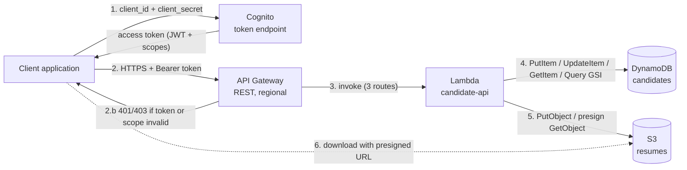

# Candidate Management API — Technical Specification

| | |
|---|---|
| **Version** | 1.1 |
| **Scope** | REST API to create, read and list candidates and their resumes |
| **Stack** | Terraform (AWS provider 6.x) deploying the five requested services: Cognito, API Gateway (REST), Lambda (Python 3.13, arm64), DynamoDB, S3 |

---

## 1. Overview

The API lets a trusted client application manage job candidates:

| Feature | Endpoint | Required scope |
|---|---|---|
| Create a candidate and upload the resume | `POST /candidates` | `candidates.write` |
| Get a candidate and a temporary resume download link | `GET /candidates/{candidateId}` | `candidates.read` |
| List the candidates of a specialty (optional feature, implemented) | `GET /candidates?specialty={specialty}` | `candidates.read` |

Callers are applications, not humans, so authentication uses the **OAuth2 Client Credentials** flow issued by Amazon Cognito.

The focus of the deliverable is the infrastructure: everything is deployed with Terraform and the whole stack can be destroyed and re-created in a few minutes.

The stack uses exactly the five services requested by the exercise. The only other resources are the ones these services need to run: the IAM execution role of the Lambda function, its CloudWatch log group (fixed retention), the permissions that let API Gateway invoke the function, and the Cognito resource server and domain used by the OAuth2 token endpoint.

---

## 2. Architecture



### 2.1 Request flow

1. The client exchanges its `client_id` / `client_secret` for an access token at the Cognito `/oauth2/token` endpoint, requesting one or more scopes.
2. The client calls the API with `Authorization: Bearer <access_token>`. API Gateway applies stage throttling, then its Cognito authorizer validates the signature, issuer, expiry and **required scope** of the token. If any check fails, API Gateway rejects the call itself (2.b, `401`/`403`) and Lambda is never invoked.
3. API Gateway invokes the Lambda function (proxy integration). The function routes the call on the HTTP method and resource path.
4. The function reads or writes DynamoDB.
5. The function uploads the resume to S3 (POST) or generates a presigned download URL (GET).
6. The client downloads the resume directly from S3 with the presigned URL. The file never transits through the API on the way out.

### 2.2 Components

| Component | Role | Key configuration |
|---|---|---|
| **Cognito User Pool** | OAuth2 authorization server | Resource server with scopes `candidates.read` / `candidates.write`; one confidential app client allowed to request both scopes; self sign-up disabled; token revocation enabled; access token lifetime 60 min |
| **API Gateway (REST, regional)** | Public entry point | Cognito authorizer with scopes on every method; request validation on required parameters; stage throttling (50 rps, burst 100); JSON error responses |
| **Lambda** | Business logic | One function for the three routes; Python 3.13 on arm64 (Graviton), 512 MB, 15 s timeout; one least-privilege IAM role; JSON structured logs in a CloudWatch log group with fixed retention |
| **DynamoDB** | Candidate metadata | On-demand capacity; PK `candidateId`; GSI `specialty-index`; encryption at rest (DynamoDB default); point-in-time recovery |
| **S3** | Resume storage | Private, versioned, SSE-S3 encryption (AES-256), TLS-only bucket policy, lifecycle rules |

---

## 3. API contract

Base URL: `https://{api-id}.execute-api.{region}.amazonaws.com/v1` (Terraform output `api_base_url`).

### 3.1 `POST /candidates`

`Content-Type: multipart/form-data`

| Field | Type | Rules |
|---|---|---|
| `specialty` | text | 2–50 characters, `[A-Za-z0-9_-]`, starts with a letter (used in the S3 key) |
| `firstName` | text | 1–100 characters, no control characters or `< > " / \` |
| `lastName` | text | Same as `firstName` |
| `birthDate` | text | `YYYY-MM-DD`, between 1900-01-01 and yesterday |
| `resume` | file | `pdf`, `doc`, `docx`, `ppt`, `pptx`, `odt`; max 4 MB; the file signature (magic bytes) must match the extension |

**Response `201 Created`**

```json
{
  "candidateId": "CA-000008",
  "specialty": "Informatique",
  "firstName": "Ada",
  "lastName": "Lovelace",
  "birthDate": "1985-12-10",
  "resumeKey": "Informatique/CA-000008.pdf"
}
```

### 3.2 `GET /candidates/{candidateId}`

**Response `200 OK`**

```json
{
  "candidateId": "CA-000001",
  "specialty": "Informatique",
  "firstName": "Josephine",
  "lastName": "Darakjy",
  "birthDate": "1970-01-01",
  "resume": {
    "key": "Informatique/CA-000001.pdf",
    "downloadUrl": "https://<bucket>.s3.eu-west-3.amazonaws.com/Informatique/CA-000001.pdf?X-Amz-Algorithm=AWS4-HMAC-SHA256&...",
    "expiresInSeconds": 300
  }
}
```

The requirement mentions a "Shared Access Signature (SAS) URL", which is Azure terminology. The AWS equivalent is an **S3 presigned URL**: a SigV4-signed, time-limited link that grants `GetObject` on a single object. It is sent with `Content-Disposition: attachment` so browsers download the file.

### 3.3 `GET /candidates?specialty={specialty}[&limit={1-100}][&nextToken={token}]`

**Response `200 OK`**

```json
{
  "specialty": "Informatique",
  "count": 3,
  "items": [
    { "candidateId": "CA-000001", "specialty": "Informatique", "firstName": "Josephine", "lastName": "Darakjy", "birthDate": "1970-01-01" }
  ],
  "nextToken": null
}
```

Results are paginated. `nextToken` is an opaque token (the DynamoDB `LastEvaluatedKey`), validated server side and bound to the requested specialty. List results do not include download URLs: the caller fetches them per candidate, which avoids issuing many signed links at once.

### 3.4 Errors

All errors, whether raised by API Gateway or by Lambda, share the same body format: `{"message": "...", "requestId": "..."}`.

| Status | When |
|---|---|
| `400` | Missing or invalid field or parameter, unsupported or spoofed file, invalid `nextToken` |
| `401` / `403` | Missing, expired or invalid token, or token without the required scope (rejected by API Gateway, Lambda is not invoked) |
| `404` | Unknown candidate |
| `413` | Resume above the configured limit, or body above the API Gateway limit |
| `415` | `POST` body is not `multipart/form-data` |
| `429` | Stage throttling |
| `500` | Unexpected error. Details are logged, never returned to the caller |

---

## 4. Data model

### 4.1 DynamoDB table `{project}-{env}-candidates`

The table follows the structure given in the exercise.

| Attribute | Type | Example | Notes |
|---|---|---|---|
| `candidateId` | S | `CA-000001` | **Partition key** |
| `specialty` | S | `Informatique` | GSI partition key |
| `candidateFirstName` | S | `Josephine` | |
| `candidateLastName` | S | `Darakjy` | |
| `candidateBirthDate` | S | `1970-01-01` | ISO 8601 |
| `cvS3Key` | S | `Informatique/CA-000001.pdf` | |

**Access patterns**

| Pattern | Operation |
|---|---|
| Get by ID | `GetItem` on `candidateId` (strongly consistent available) |
| List by specialty | `Query` on GSI `specialty-index` (`specialty` + `candidateId`), projection limited to name and birth date |
| Generate the next ID | Atomic `UpdateItem ADD` on the reserved item `#SEQUENCE#candidate` |

`candidateId` is the partition key rather than `specialty` because "get a candidate" only receives the ID. Listing by specialty is handled by the GSI instead.

The sequence item has no `specialty` attribute, so it never appears in the GSI (a sparse index). Its key is also rejected by the ID validation regex, so it cannot be read through the API.

### 4.2 S3 bucket `{project}-{env}-resumes-{region}-{suffix}`

```
Informatique/CA-000001.pdf
Informatique/CA-000004.docx
Informatique/CA-000007.ppt
Mathematique/CA-000002.docx
...
```

The key is `{specialty}/{candidateId}.{extension}`, as in the exercise. Prefixing by specialty also spreads S3 request rates across prefixes.

---

## 5. Implementation details

### 5.1 Lambda design

- **One function for the three routes.** API Gateway sends every route to the same function; its entry point `handlers.handler` dispatches on the HTTP method and resource path to `create_candidate`, `get_candidate` or `list_candidates`. The code is a single small package (`app/src`), with a shared `common.py` (clients, configuration, error handling).
- **Python 3.13, arm64.** This gives fast cold starts, and Graviton is about 20% cheaper than x86. `boto3` is provided by the runtime, so there are no dependencies to package.
- **Clients initialised outside the handler**, so they are reused across warm invocations.
- **Error handling.** A decorator maps validation errors to 4xx responses. Unexpected exceptions are logged with a stack trace and returned as a generic `500` that includes the request ID.
- **Logging.** Logs are structured JSON and each request writes one audit line (`route`, `requestId`, `clientId`, `status`). No personal data (names, birth dates, file contents) is ever logged.

### 5.2 Resume upload

The client sends a single `multipart/form-data` request. The flow is:

1. API Gateway is configured with `binary_media_types = ["multipart/form-data"]`, so it forwards the body base64-encoded.
2. Lambda parses the body with the Python standard library (`email` parser, no third-party dependency).
3. Lambda validates the fields and the file: extension allow-list, size, and **magic bytes** (`%PDF-`, ZIP for OOXML/ODF, OLE2 for legacy Office). This rejects renamed executables or scripts.
4. Lambda allocates the next ID with an atomic counter.
5. `PutObject` stores the file. Encryption is SSE-S3 through the bucket default.
6. `PutItem` stores the metadata with the condition `attribute_not_exists(candidateId)`.
7. **Compensation.** If step 6 fails, the exact object version uploaded in step 5 is deleted, so no orphan resume remains. This path is covered by a local test.

Writing S3 first means a failure can at worst leave a file without metadata, which is then compensated. A DynamoDB item never points to a missing file.

### 5.3 Candidate ID generation

The format `CA-000001` from the exercise implies a sequence. It is implemented with a DynamoDB atomic counter, which requires no extra service and has no race condition. Its trade-offs are documented in §8.3.

### 5.4 Resume download

The `GET` route signs a `GetObject` URL with the function's role credentials:

- Validity is 300 s (configurable from 60 to 3600 s).
- The URL uses SigV4 on the regional virtual-hosted endpoint.
- Anyone holding the URL can download that single object until it expires. The URL must therefore be treated as a secret by the client, and it is never logged.

---

## 6. Security

Security is applied in layers, following the principle "deny by default, grant the minimum".

### 6.1 Identity and access (OAuth2 client credentials)

| Control | Implementation |
|---|---|
| Authentication | One confidential Cognito app client (`client_id` + `client_secret`). Only the `client_credentials` grant is allowed; there are no users, no hosted UI, and self sign-up is disabled |
| Authorization | Custom scopes enforced **per method** by API Gateway: `candidates.write` for `POST`, `candidates.read` for `GET` |
| Least privilege per token | The client can request only the scopes it needs. A token requested with `candidates.read` only is rejected on `POST` at the gateway |
| Token lifetime | Access tokens last 60 min (configurable). Token revocation is enabled. Clients are expected to cache tokens until they expire |
| Token validation | Performed by API Gateway before any compute runs: signature against the JWKS, issuer, expiry and scope. Invalid calls never reach Lambda, which also limits cost-based abuse |

### 6.2 Transport and entry point

- **HTTPS only.** API Gateway and Cognito only expose TLS endpoints. The S3 bucket policy denies any request without `aws:SecureTransport` or with TLS < 1.2.
- **API Gateway throttling** at stage level (50 rps, burst 100) caps spikes and protects the downstream services. Excess calls get `429`.
- **Request validation** at the gateway: required parameters are checked before Lambda runs.
- **No VPC.** Lambda only calls DynamoDB and S3, which are managed services reached over TLS on AWS endpoints. Access is controlled by IAM, not by the network, so a VPC would add NAT or endpoint cost and complexity without reducing the attack surface of this design.

### 6.3 Data protection

| Data | Protection |
|---|---|
| DynamoDB items (personal data: names, birth date) | Always encrypted at rest (DynamoDB default encryption, AES-256); point-in-time recovery (35 days) |
| Resumes (S3) | SSE-S3 (AES-256); all public access blocked; `BucketOwnerEnforced` (ACLs disabled); versioning enabled; noncurrent versions expire after 30 days; bucket policy denies uploads that request another encryption mode |
| Logs | Lambda logs only, encrypted by CloudWatch Logs, with explicit retention. Each request writes one audit line (route, request ID, `client_id`, status) and no personal data. API Gateway data tracing is **disabled** (bodies are never logged) |
| Secrets | No secrets in code or in Lambda environment variables. Client secrets are generated by Cognito and exist only in the encrypted remote state; scripts read them through `terraform output`. |

**GDPR note.** Candidate data is personal data. The design supports data minimisation: list responses use a projected index and logs contain no personal data. It also provides encryption, access traceability (`client_id` in the Lambda audit line) and time-bound access to documents. A deletion (right to erasure) endpoint is not part of the requested scope (§8.6).

### 6.4 Least-privilege IAM

The function has one execution role granting exactly the actions of the three routes, on the exact resources they use. No wildcard action is granted on data resources.

| Allowed actions | Resources | Used by |
|---|---|---|
| `dynamodb:GetItem`, `dynamodb:PutItem`, `dynamodb:UpdateItem` | The table | `POST` (counter + item), `GET` by ID |
| `dynamodb:Query` | **The GSI only** | `GET` by specialty |
| `s3:PutObject`, `s3:DeleteObjectVersion` | `bucket/*` | `POST` (upload + rollback) |
| `s3:GetObject` | `bucket/*` | `GET` by ID (presigned URL signing) |
| `logs:CreateLogStream`, `logs:PutLogEvents` | **Its own** log group | All routes |

API Gateway gets `lambda:InvokeFunction` through three resource-based permissions, each scoped with `source_arn` to this API, one method and one path.

The trust policy is restricted with `aws:SourceAccount`.

### 6.5 Application-level validation

- Strict allow-list regexes on every field. `specialty` is part of the S3 key, so it can only contain `[A-Za-z0-9_-]`, which prevents path traversal.
- File type is checked by both extension and content signature.
- Size limits are enforced before any write.
- `nextToken` is decoded, validated and bound to the requested specialty, which prevents cursor tampering.
- Internal errors are never returned to callers.
- Response headers: `Strict-Transport-Security`, `X-Content-Type-Options: nosniff`, `Cache-Control: no-store`.

### 6.6 Supply chain and infrastructure as code

- Terraform ≥ 1.10 and the AWS provider are pinned (`~> 6.0`). `.terraform.lock.hcl` must be committed after the first `init`.
- Remote state is stored in a dedicated, versioned, encrypted, TLS-only S3 bucket, with **S3 native locking** (`use_lockfile`), so no DynamoDB lock table is needed.
- `make lint` runs `tflint` and `checkov`.
  - Current checkov result: **84 checks passed, 0 failed**.
  - The 20 skipped checks are deliberate design decisions, each justified inline with `#checkov:skip`. Examples: no API cache for personal data, no DLQ for synchronous invocations, no VPC, AWS managed encryption, and services outside the five requested ones.

---

## 7. Terraform design

### 7.1 Layout

```
.
├── bootstrap/                  # Remote state bucket (applied once, local state)
├── infra/                      # Main stack
│   ├── versions.tf  providers.tf  backend.tf
│   ├── variables.tf locals.tf     outputs.tf
│   ├── main.tf                 # Module wiring
│   ├── iam.tf                  # Least-privilege policy of the function
│   └── modules/
│       ├── s3_bucket/          # Hardened private bucket
│       ├── dynamodb_table/     # Candidates table + GSI
│       ├── cognito/            # User pool, domain, resource server, clients
│       ├── lambda_function/    # Function + role + log group
│       └── api_gateway/        # REST API, authorizer, routes, stage, logs
├── app/src/                    # Lambda code (handlers.py, common.py)
├── scripts/                    # get-token, seed, demo
├── postman/                    # Postman collection (OAuth2 client credentials)
├── samples/                    # Demo resumes
└── Makefile
```

### 7.2 Conventions and practices

- **Small, single-purpose modules** with typed and **validated** variables, documented outputs, and no hard-coded account, region or partition.
- **Data-driven configuration.** Routes and scopes are declared as maps and expanded with `for_each`. Adding a route means one map entry in Terraform and one line in the function's route table.
- **Naming.** Resources are named `{project}-{environment}-{component}`. A random suffix is appended only where names must be globally unique (S3 bucket, Cognito domain).
- **Tagging.** `default_tags` apply `Project`, `Environment`, `Owner`, `ManagedBy` and `DataClass` everywhere.
- **Explicit dependencies** only where Terraform cannot infer them: IAM policies before the function, public access block before the bucket policy.
- **API Gateway redeployment** is driven by a hash of every API definition resource, with `create_before_destroy` to avoid downtime.
- **Pre-created Lambda log group** keeps retention under Terraform control and ensures it is removed on destroy.
- **Destroy-friendly defaults for the demo.** `deletion_protection_enabled = false` and `force_destroy_bucket = true`. Both are variables and must be flipped for production.

### 7.3 Key variables

| Variable | Default | Purpose |
|---|---|---|
| `aws_region` | `eu-west-3` | Region (Paris) |
| `environment` | `dev` | `dev` / `staging` / `prod` |
| `deletion_protection_enabled` | `false` | DynamoDB and Cognito protection (`true` in prod) |
| `force_destroy_bucket` | `true` | Allow destroying a non-empty bucket (`false` in prod) |
| `presigned_url_ttl_seconds` | `300` | Download link validity |
| `max_resume_size_bytes` | `4194304` | Upload limit (≤ 4.4 MB, see §8) |
| `api_throttling_rate_limit` / `_burst_limit` | `50` / `100` | Stage throttling |
| `log_retention_days` | `30` | Retention of every log group |

---

## 8. Limitations and operating constraints

Values are AWS default quotas at the time of writing. Adjustable quotas can be raised through Service Quotas.

### 8.1 Latency and response time

Figures are indicative estimates for `eu-west-3` and must be confirmed with a load test.

| Scenario | Indicative latency |
|---|---|
| Token request (Cognito) | ~100–300 ms (clients should cache the token for its lifetime) |
| `GET /candidates/{id}`, warm | ~50–150 ms end to end (DynamoDB single-digit ms; presigning is local and needs no network call) |
| `GET /candidates?specialty=`, warm | ~50–150 ms per page |
| `POST /candidates`, warm | ~150 ms + upload time (proportional to file size and client bandwidth) |
| Cold start (Python, arm64, 512 MB) | adds ~300–800 ms to the first request of a new execution environment |
| Authorizer overhead | a few ms (JWT validated locally by API Gateway against cached Cognito signing keys) |

Hard timeouts:
- The API Gateway integration timeout is **29 s** by default.
- The Lambda timeout is set to **15 s**, so a slow call fails cleanly before the gateway timeout.

### 8.2 Payload and file size

| Limit | Value | Impact |
|---|---|---|
| API Gateway REST payload | **10 MB** (hard) | Absolute ceiling for any request |
| Lambda synchronous invocation payload | **6 MB** (request and response) | Binary bodies arrive base64-encoded (+33%), so the effective file limit is about **4.4 MB** |
| Configured resume limit | **4 MB** (variable) | Returns `413` above it |
| S3 object size | 5 GB per `PUT`, 5 TB with multipart | Not a constraint for resumes |
| Presigned URL validity | up to 7 days with SigV4, and never longer than the credentials that signed it | Lambda role credentials are short-lived, so short TTLs (minutes) are the right choice |

To accept larger files, the upload would have to go directly to S3 with a presigned `PUT` URL instead of through the API.

### 8.3 DynamoDB

| Limit | Value | Impact |
|---|---|---|
| Item size | 400 KB | Metadata only; files live in S3 |
| Throughput per partition | 3,000 RCU / 1,000 WCU | The **sequence counter is a single hot item**, capping candidate creation at roughly 1,000 writes/s. This is ample for recruitment workloads; switch to ULID/UUID identifiers for higher write rates |
| On-demand table default limit | 40,000 read / 40,000 write request units per second (adjustable) | Scales automatically, with burst adaptation |
| GSI | Eventually consistent; its write throughput is also limited per partition key | A newly created candidate may take a moment to appear in listings; a very popular specialty is a hot GSI partition (mitigation: write sharding) |
| `Query` page size | 1 MB of data per call | Handled with `limit` + `nextToken` pagination |
| GSI count | 20 per table (default) | Room for future access patterns (for example by `lastName`) |

### 8.4 Lambda

| Limit | Value | Impact |
|---|---|---|
| Account concurrency | 1,000 per region by default (new accounts may start lower) | Used by the single function. Reserved concurrency can be set (`lambda_reserved_concurrency`) |
| Scaling rate | Up to 1,000 new concurrent executions every 10 s per function | Handles sudden spikes. API Gateway throttling absorbs the rest |
| Memory / timeout | 512 MB / 15 s | Enough for a 4 MB upload; tune with Lambda Power Tuning |

### 8.5 API Gateway, Cognito, S3

- **API Gateway.**
  - Account-level throttle of 10,000 rps with a burst of 5,000 (adjustable).
  - The stage is intentionally capped lower (50 rps / burst 100), which is configurable.
- **Cognito.**
  - Token endpoint requests are subject to per-account quotas and are billed for machine-to-machine clients. Clients must reuse tokens until they expire instead of requesting a token per call.
  - The access token lifetime can be set between 5 min and 1 day.
- **S3.** At least 3,500 write and 5,500 read requests per second **per prefix**. The per-specialty prefix spreads the load.

### 8.6 Functional limitations (current version)

- There is no update or delete endpoint. Resumes are immutable once uploaded.
- There is no antivirus scan: files are validated by type and content signature only.
- Specialties are free text restricted to ASCII letters, digits, `_` and `-`, so accented specialties are not accepted. A reference list could be enforced.
- The API uses the default `execute-api` domain; there is no custom domain.

---

## 9. Deployment

### 9.1 Prerequisites

- An AWS account and credentials with administrator rights on the target account (for example `aws sso login` or a named profile).
- Terraform ≥ 1.10, AWS CLI v2, `curl`, `jq`, `make`.

### 9.2 Steps

```bash
# 0. Credentials and region
export AWS_PROFILE=<your-profile>
export AWS_REGION=eu-west-3

# 1. Remote state (once): creates the state bucket and writes infra/backend.hcl
make bootstrap

# 2. Configure the stack
cp infra/terraform.tfvars.example infra/terraform.tfvars   # adjust if needed

# 3. Deploy
make init
make apply          # terraform plan -out=tfplan && terraform apply tfplan  (42 resources, ~2-3 min)

# 4. Outputs
make outputs
```

Main outputs:
- `api_base_url`
- `token_endpoint`
- `client_id`
- `client_scopes`
- `client_secret` (sensitive: read it with `terraform -chdir=infra output -raw client_secret`)
- `resume_bucket_name`
- `candidates_table_name`

### 9.3 Destroy and re-create (demo)

```bash
make destroy        # removes every resource of the main stack (the state bucket is kept)
make apply          # re-creates everything
make seed           # reloads the 7 sample candidates (CA-000001 .. CA-000007)
make demo           # end-to-end test
```

`make redeploy` chains destroy and apply.

Destroy side effect: the bucket and Cognito domain get a new random suffix, so every output value changes. The scripts always read current outputs.

---

## 10. Testing the API

### 10.1 Automated scripts

| Command | What it does |
|---|---|
| `make token` | Prints an access token with both scopes (`make token SCOPE=candidates.read` for a read-only token) |
| `make seed` | Creates the 7 candidates of the exercise data set |
| `make demo` | Runs the scenario: 401 without token → token → create → get → download → list → read-only token cannot create → invalid file → 404 → missing parameter → tampered token |

### 10.2 Manual curl commands

```bash
cd infra
API=$(terraform output -raw api_base_url)
TOKEN_URL=$(terraform output -raw token_endpoint)
CLIENT_ID=$(terraform output -raw client_id)
CLIENT_SECRET=$(terraform output -raw client_secret)
SCOPE=$(terraform output -json client_scopes | jq -r 'join(" ")')
```

**1. Get an access token (client credentials)**

```bash
TOKEN=$(curl -s -X POST "$TOKEN_URL" \
  -u "$CLIENT_ID:$CLIENT_SECRET" \
  -H "Content-Type: application/x-www-form-urlencoded" \
  --data-urlencode "grant_type=client_credentials" \
  --data-urlencode "scope=$SCOPE" | jq -r .access_token)
```

**2. Create a candidate**

```bash
curl -s -X POST "$API/candidates" \
  -H "Authorization: Bearer $TOKEN" \
  -F "specialty=Informatique" \
  -F "firstName=Josephine" \
  -F "lastName=Darakjy" \
  -F "birthDate=1970-01-01" \
  -F "resume=@../samples/resume.pdf" | jq
```

**3. Get a candidate and download the resume**

```bash
curl -s "$API/candidates/CA-000001" -H "Authorization: Bearer $TOKEN" | tee /tmp/c.json | jq
curl -s -o CA-000001.pdf "$(jq -r .resume.downloadUrl /tmp/c.json)"
```

**4. List candidates by specialty**

```bash
curl -s "$API/candidates?specialty=Informatique&limit=20" -H "Authorization: Bearer $TOKEN" | jq
```

**5. Negative tests**

```bash
curl -i "$API/candidates/CA-000001"                                      # 401: no token
curl -i "$API/candidates" -H "Authorization: Bearer $TOKEN"              # 400: specialty missing
curl -i "$API/candidates/CA-999999" -H "Authorization: Bearer $TOKEN"    # 404
curl -i -X POST "$API/candidates" -H "Authorization: Bearer $TOKEN" \
  -F specialty=Informatique -F firstName=A -F lastName=B -F birthDate=1990-01-01 \
  -F "resume=@../samples/invalid.txt"                                    # 400: unsupported type
# With a token requested with candidates.read only, POST /candidates is rejected by the authorizer (scope missing).
```

### 10.3 Postman

1. Import `postman/candidate-api.postman_collection.json`.
2. Fill in the collection variables `baseUrl`, `tokenUrl`, `clientId`, `clientSecret` and `scope` from the Terraform outputs.
3. In the collection **Authorization** tab (OAuth 2.0, Client Credentials, client authentication in header), click **Get New Access Token** and then **Use Token**.
4. Run *Create candidate*. It stores the returned `candidateId`, which *Get candidate* then uses.

### 10.4 Observability during tests

- Function logs: CloudWatch log group `/aws/lambda/{project}-{env}-api`, with JSON structure and one audit line per request
- Metrics: API Gateway and Lambda default metrics in the CloudWatch console

---

## 11. Design trade-offs

| Decision | Why | What it costs |
|---|---|---|
| **REST API** rather than HTTP API | Per-method OAuth2 scopes with the Cognito authorizer, request validation, gateway responses | Slightly higher price per request |
| **One function for the three routes** | One function, one role, one log group: the simplest stack, and warm instances serve every route | The role holds the permissions of all routes, so a flaw in one route can reach what the others may do |
| **`candidateId` as partition key + GSI** | `GET` only receives the ID; listing uses the index | The index is eventually consistent |
| **Sequential ID with an atomic counter** | Matches the `CA-000001` format of the exercise with no extra service | One hot item, about 1,000 creations per second maximum |
| **Upload through the API** | One call creates the candidate and stores the file | Resume limited to 4 MB by the Lambda payload limit |
| **AWS managed encryption** (SSE-S3, DynamoDB default) | Encryption at rest with no extra service or key to manage | Keys are not under the account's control and cannot be revoked independently |
| **No VPC** | Only managed AWS services are called, and access is controlled by IAM | Network isolation relies on IAM and TLS rather than private subnets |
| **Destroy-friendly defaults** | Live `destroy` / `apply` demo | `deletion_protection_enabled` and `force_destroy_bucket` must be changed for production |

### Indicative monthly cost (low traffic, dev)

| Item | Estimate |
|---|---|
| Cognito | Machine-to-machine usage is billed per app client and per token request (see current Cognito pricing) |
| Lambda, API Gateway, DynamoDB on-demand, S3 | Pay per use; a few dollars at most for demo traffic |
| CloudWatch Logs | Ingestion and storage of the logs; a few cents at demo volume |
